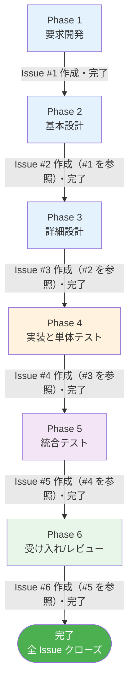

# ペットホテル機能追加ハンズオン - スタートガイド (エージェント活用版)

## ようこそ！

このハンズオンでは、Spring PetClinic REST アプリケーションに「ペットホテル機能」を追加しながら、**Issue Driven Development** のワークフローと **GitHub Copilot カスタムエージェント** の活用方法を実践的に学びます。

## 📋 ハンズオン資料一覧

このハンズオンには以下の資料が用意されています：

| 資料名 | 用途 | 対象者 |
|--------|------|--------|
| **HANDS_ON_GUIDE.md** | メインガイド | 全参加者 |
| **QUICK_REFERENCE.md** | コマンド・パス集 | 全参加者 |
| **AGENT_PROMPT_GUIDE.md** | エージェント活用ガイド | 全参加者 |
| **.github/ISSUE_TEMPLATE/*.yml** | 工程別Issue Formテンプレート（6種類） | 全参加者 |
| **PR_TEMPLATE.md** | PR作成用テンプレート | 全参加者 |
| **INSTRUCTOR_GUIDE.md** | 指導用ガイド | 講師のみ |

## 🎯 学習目標

このハンズオンを通じて、以下のスキルを習得します：

1. ✅ **Issue Driven Development** の実践
   - 工程ごとの Issue 作成（Phase 1-7）
   - Issue Form の活用
   - タスクの細分化と追跡
   - 工程間の依存関係管理

2. ✅ **GitHub Copilot カスタムエージェント活用**
   - 開発工程ごとの適切なエージェント選択
   - PM、アーキテクト、テックリード、シニアデベロッパー、QA、リードエージェントの活用
   - 効果的なプロンプティング

3. ✅ **Git ワークフロー**
   - Feature ブランチ戦略
   - 適切なコミット粒度
   - リモートリポジトリとの連携

4. ✅ **Pull Request プロセス**
   - 効果的なPR作成
   - コードレビューの実施
   - フィードバックへの対応

5. ✅ **Spring Boot 開発**
   - エンティティ設計（JPA）
   - Repository パターン
   - Service レイヤー実装
   - REST API 開発
   - テスト駆動開発

## 🚀 クイックスタート

### ステップ1: 環境確認

以下がインストールされていることを確認してください：

```bash
# Java バージョン確認（17以上）
java -version

# Maven バージョン確認（3.9以上）
mvn -version

# Git バージョン確認
git --version
```

**重要**: GitHub Copilot サブスクリプションが必要です。
- GitHub Copilot Individual または Business
- エージェント機能が利用可能であること

### ステップ2: リポジトリのフォークとクローン

1. GitHub で [spring-petclinic-rest](https://github.com/anishi1222/spring-petclinic-rest) をフォーク
2. ローカルにクローン：

```bash
git clone https://github.com/YOUR_USERNAME/spring-petclinic-rest.git
cd spring-petclinic-rest
```

### ステップ3: ハンズオン資料の配置

このハンズオン資料をクローンしたリポジトリに配置：

```bash
# 以下のファイルがプロジェクトルートにあることを確認
ls -la HANDS_ON_*.md
ls -la ISSUE_TEMPLATE.md PR_TEMPLATE.md
ls -la QUICK_REFERENCE.md
```

### ステップ4: アプリケーションの起動確認

```bash
# ビルド
mvn clean install

# 起動
mvn spring-boot:run
```

ブラウザで http://localhost:9966/petclinic にアクセスできれば成功です！

### ステップ5: メインガイドを開く

**HANDS_ON_GUIDE.md** を開いて、セクション1から開始してください。

---

## 📚 各資料の使い方

### HANDS_ON_GUIDE.md
- **最も重要な資料**
- 最初から最後まで順番に進めてください
- 各セクションには詳細な手順が記載されています
- コピー&ペーストできるコードスニペットが含まれています

### QUICK_REFERENCE.md
- 作業中に頻繁に参照するチートシート
- Gitコマンド、Mavenコマンド、curlコマンドなど
- ファイルパスやコードスニペット
- **別ウィンドウで開いておくと便利**

### .github/ISSUE_TEMPLATE/*.yml (Issue Forms)
- 各工程（Phase 1-6）に対応する Issue Form テンプレート
- GitHub の Issue 作成画面で選択可能
- 構造化されたフォーム形式で必要な情報を入力
- 自動的に適切なラベルが付与されます

**6つの Issue Form**:
1. `01_requirement.yml` - Phase 1: 要求開発
2. `02_basic_design.yml` - Phase 2: 基本設計
3. `03_detailed_design.yml` - Phase 3: 詳細設計
4. `04_implementation.yml` - Phase 4: 実装と単体テスト
5. `05_integration_test.yml` - Phase 5: 統合テスト
6. `06_acceptance_review.yml` - Phase 6: 受け入れ/レビュー

### PR_TEMPLATE.md
- セクション5でPull Requestを作成する際に使用
- 変更内容を説明するためのテンプレート
- チェックリストで漏れを防止

### INSTRUCTOR_GUIDE.md
- 講師・メンター向けの詳細ガイド
- 各セクションの指導ポイント
- よくある質問と回答
- トラブルシューティング

---

## 🎓 前提知識

このハンズオンを最大限活用するために、以下の知識があることが望ましいです：

### 必須
- ✅ Java の基本文法
- ✅ オブジェクト指向プログラミングの基礎
- ✅ Git の基本操作（clone, commit, push）
- ✅ REST API の基本概念

### あると良い
- 🔹 Spring Boot の基礎
- 🔹 JPA / Hibernate の基礎
- 🔹 Maven の基本
- 🔹 JUnit によるテスト

### 不要（ハンズオン内で学べます）
- Issue Driven Development
- Pull Request ワークフロー
- コードレビュープロセス
- Spring Data JPA の詳細
- MapStruct の使い方

---

## 🛠️ 実装する機能

### ペットホテル機能とは？

ペットクリニックに来院する飼い主から、旅行や出張中にペットを預かってほしいという要望に応える機能です。

### 主要な機能

1. **予約管理**
   - チェックイン日とチェックアウト日の記録
   - 部屋番号の管理
   - ステータス管理（予約済み、チェックイン済み、チェックアウト済み）

2. **REST API**
   - `GET /api/pethotelstays` - 予約一覧取得
   - `GET /api/pethotelstays/{id}` - 特定予約取得
   - `POST /api/pethotelstays` - 新規予約作成
   - `PUT /api/pethotelstays/{id}` - 予約更新
   - `DELETE /api/pethotelstays/{id}` - 予約削除

3. **データモデル**

```
PetHotelStay
├── id (主キー)
├── pet (Petへの参照)
├── checkInDate (チェックイン日)
├── checkOutDate (チェックアウト日)
├── roomNumber (部屋番号)
└── status (ステータス)
```

### 設計方針

- ✅ **既存パターンの踏襲**: Visit エンティティと同様の構造
- ✅ **最小限の実装**: スコープクリープを避ける
- ✅ **既存機能の活用**: Pet エンティティとの関連付け
- ✅ **テストの充実**: すべてのCRUD操作をテスト

---

## 📊Issue Driven Development ワークフロー

このハンズオンは、**6つの工程（Phase 1-6）**に分かれており、各工程ごとに **Issue → 作業 → PR → 承認 → マージ** のサイクルを繰り返します。

```mermaid
flowchart TD
    Start(["スタート"]) --> P1_Start["Phase 1: 要求開発"]
    
    P1_Start --> P1_Issue["Issue #1 作成<br/>要件定義"]
    P1_Issue --> P1_Doc["docs/phase1-requirements.md<br/>作成"]
    P1_Doc --> P1_PR["PR #1 作成"]
    P1_PR --> P1_Review["レビュー"]
    P1_Review --> P1_Approve{"承認?"}
    P1_Approve -->|Yes| P1_Merge["マージ"]
    P1_Approve -->|No| P1_Doc
    P1_Merge --> P1_Close["Issue #1 クローズ"]
    
    P1_Close --> P2_Start["Phase 2: 基本設計"]
    P2_Start --> P2_Issue["Issue #2 作成<br/>#1 を参照"]
    P2_Issue --> P2_Doc["docs/phase2-basic-design.md<br/>作成"]
    P2_Doc --> P2_PR["PR #2 作成"]
    P2_PR --> P2_Review["レビュー"]
    P2_Review --> P2_Approve{"承認?"}
    P2_Approve -->|Yes| P2_Merge["マージ"]
    P2_Approve -->|No| P2_Doc
    P2_Merge --> P2_Close["Issue #2 クローズ"]
    
    P2_Close --> P3_Start["Phase 3: 詳細設計"]
    P3_Start --> P3_Issue["Issue #3 作成<br/>#2 を参照"]
    P3_Issue --> P3_Doc["docs/phase3-detailed-design.md<br/>作成"]
    P3_Doc --> P3_PR["PR #3 作成"]
    P3_PR --> P3_Review["レビュー"]
    P3_Review --> P3_Approve{"承認?"}
    P3_Approve -->|Yes| P3_Merge["マージ"]
    P3_Approve -->|No| P3_Doc
    P3_Merge --> P3_Close["Issue #3 クローズ"]
    
    P3_Close --> P4_Start["Phase 4: 実装と単体テスト"]
    P4_Start --> P4_Issue["Issue #4 作成<br/>#3 を参照"]
    P4_Issue --> P4_Impl["feature/pet-hotel ブランチで実装<br/>Entity, Repository, Service, Controller"]
    P4_Impl --> P4_Test["単体テスト実装<br/>カバレッジレポート"]
    P4_Test --> P4_PR["PR #4 作成"]
    P4_PR --> P4_Review["レビュー"]
    P4_Review --> P4_Approve{"承認?"}
    P4_Approve -->|Yes| P4_Merge["マージ"]
    P4_Approve -->|No| P4_Impl
    P4_Merge --> P4_Close["Issue #4 クローズ"]
    
    P4_Close --> P5_Start["Phase 5: 統合テスト"]
    P5_Start --> P5_Issue["Issue #5 作成<br/>#4 を参照"]
    P5_Issue --> P5_Test["API統合テスト実施<br/>curl/Postman"]
    P5_Test --> P5_PR["PR #5 作成"]
    P5_PR --> P5_Review["レビュー"]
    P5_Review --> P5_Approve{"承認?"}
    P5_Approve -->|Yes| P5_Merge["マージ"]
    P5_Approve -->|No| P5_Test
    P5_Merge --> P5_Close["Issue #5 クローズ"]
    
    P5_Close --> P6_Start["Phase 6: 受け入れ/レビュー"]
    P6_Start --> P6_Issue["Issue #6 作成<br/>#5 を参照"]
    P6_Issue --> P6_Review_Work["全体レビュー<br/>振り返り"]
    P6_Review_Work --> P6_PR["PR #6 作成"]
    P6_PR --> P6_Review["レビュー"]
    P6_Review --> P6_Approve{"承認?"}
    P6_Approve -->|Yes| P6_Merge["マージ"]
    P6_Approve -->|No| P6_Review_Work
    P6_Merge --> P6_Close["Issue #6 クローズ"]
    
    P6_Close --> Complete(["全工程完了"])
    
    style P1_Start fill:#e1f5ff
    style P2_Start fill:#e1f5ff
    style P3_Start fill:#e1f5ff
    style P4_Start fill:#e1f5ff
    style P5_Start fill:#e1f5ff
    style P6_Start fill:#e1f5ff
    style Complete fill:#90EE90
```



### 🎯 IDD のメリット

1. **📝 明確なタスク管理**: 各工程の目的と成果物がIssueで明確化
2. **🔄 高頻度フィードバック**: 工程ごとにレビューで品質向上
3. **👥 チームコラボレーション**: IssueとPRでコミュニケーションが可視化
4. **📈 進捗追跡**: どの工程が完了し、どの工程が残っているか一目瞭然
5. **📚 自動ドキュメント化**: IssueとPRが開発履歴を記録

---

## 📊 工程別ワークフロー

このハンズオンは、6つの工程（Phase）に分かれており、各工程ごとに Issue を作成して進めます：



**各工程の完了条件**:
- 受け入れ基準が全て満たされている
- 次工程への引き継ぎ情報が明確
- Issue に成果物が記録されている

## 🎯 成果物

ハンズオン終了時には、以下が完成します：

### コード
- ✅ `PetHotelStay` エンティティ
- ✅ `PetHotelStayRepository` インターフェース
- ✅ `ClinicService` の拡張
- ✅ `PetHotelStayRestController`
- ✅ DTO と Mapper
- ✅ テストコード

### Git / GitHub
- ✅ feature ブランチ
- ✅ 適切なコミット履歴
- ✅ 6つの工程別 Issue（Phase 1-6）
- ✅ 工程ごとのラベル管理
- ✅ Issue 間の依存関係の記録
- ✅ Pull Request（レビュー済み）
- ✅ マージされたコード

### スキル
- ✅ Issue Driven Development の理解
- ✅ GitHub Copilot カスタムエージェントの活用スキル
- ✅ 工程ごとの適切なエージェント選択能力
- ✅ Git ワークフローの習得
- ✅ コードレビュースキル
- ✅ Spring Boot 開発の実践

---

## 🆘 困ったときは

### 1. QUICK_REFERENCE.md を確認
よく使うコマンドやパスがまとまっています。

### 2. HANDS_ON_GUIDE.md のトラブルシューティング
セクション末尾にトラブルシューティングがあります。

### 3. 講師に質問
わからないことは遠慮なく質問してください。

### 4. GitHub Issues
ハンズオン資料に問題があれば、Issue を作成してください。

---

## 📝 推奨の進め方

### デュアルモニターの場合
- **モニター1**: IDE（コーディング用）
- **モニター2**: HANDS_ON_GUIDE.md と QUICK_REFERENCE.md

### シングルモニターの場合
- **画面分割**: IDE とブラウザ（ドキュメント）を並べる
- **タブ切り替え**: HANDS_ON_GUIDE.md、QUICK_REFERENCE.md、GitHub を素早く切り替え

### おすすめツール
- **Markdown ビューア**: VS Code, Typora, Markdownプレビュー
- **REST クライアント**: curl, Postman, Insomnia
- **Git GUI**: GitKraken, SourceTree（オプション）

---

## ⚡ Tips

### Git コミット
- こまめにコミットする
- 意味のある単位で区切る
- わかりやすいメッセージを書く

### コーディング
- 既存コードを参考にする（Visit, VisitRestController など）
- コピー&ペーストは理解してから
- わからないコードは質問する

---

## 🎉 ハンズオン完了後

### 追加課題にチャレンジ
HANDS_ON_GUIDE.md の最後に追加課題があります：
- ステータス管理の改善（Enum化） - シニアデベロッパーエージェント活用
- バリデーション強化 - シニアデベロッパーエージェント活用
- 統計API追加 - テックリードエージェント活用
- ペット別履歴取得 - テックリードエージェント活用

### 実践への応用
- 自分のプロジェクトで Issue Driven Development を実践
- チーム開発でPull Requestフローを導入
- GitHub Copilot カスタムエージェントを開発工程に組み込む
- コードレビュー文化の醸成

### フィードバック
ハンズオンの感想や改善提案をお待ちしています！

---

## 📞 サポート

### ハンズオン中
講師やメンターに気軽に質問してください。

### ハンズオン後
- GitHub Issues: 資料の問題報告
- Pull Request: 資料の改善提案

---

## 🙏 謝辞

このハンズオンは、[Spring PetClinic](https://github.com/spring-projects/spring-petclinic) プロジェクトをベースにしています。素晴らしいサンプルアプリケーションを提供してくださった Spring チームに感謝します。

---

**それでは、HANDS_ON_GUIDE.md を開いて、ペットホテル機能の実装を始めましょう！**

Happy Coding! 🚀
