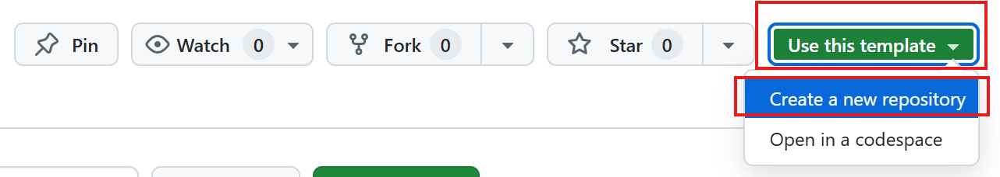

# Phase 0: 環境セットアップと既存機能の理解

**目標**:
- 開発環境をセットアップする
- Spring PetClinic REST アプリケーションの構造を理解する
- 既存のAPIとコードパターンを確認する

---

## 0.1 リポジトリのフォークとクローン

1. リポジトリの作成
    - spring-petclinic-rest リポジトリ [https://github.com/anishi1222/spring-petclinic-rest](https://github.com/anishi1222/spring-petclinic-rest) をテンプレートとして、GitHub上にリポジトリを作成してください。
    - リポジトリ名は自由ですが、間違えないように `spring-petclinic-rest` にすると良いでしょう。
    - Visibilityは Public または Private どちらでも可です。

    

2. ラベルの作成
    - リポジトリの **Issues** タブ → **Labels** に移動し、以下のラベルを新規作成してください。
    - 既存のラベルは残しても削除してもかまいません。
    - 色は任意ですが、カテゴリで色を揃えると運用しやすいです。
      - `phase:requirement`
      - `phase:basic-design`
      - `phase:detailed-design`
      - `phase:implementation`
      - `phase:unit-test`
      - `phase:integration-test`
      - `phase:acceptance`
      - `status:design`
      - `status:planning`
      - `status:in-progress`
      - `status:review`
      - `status:testing`

    - GitHub CLIを利用できる場合は、以下のように作成できます。

        ```bash
        # 例: phase:requirement
        gh label create "phase:requirement" --color "0E8A16" --description "工程: 要件定義"
        ```

3. ローカルにクローン:

    ```bash
    git clone https://github.com/YOUR_USERNAME/spring-petclinic-rest.git
    cd spring-petclinic-rest
    ```

---

## 0.2 アプリケーションの起動

```bash
# ビルドとテスト実行
mvn clean install

# アプリケーション起動
mvn spring-boot:run
```

アプリケーションは `http://localhost:9966` で起動します。

---

## 0.3 既存 API の確認

Swagger UI でAPIを確認: `http://localhost:9966/petclinic`

主要なエンドポイント:
- `GET /api/owners` - 飼い主一覧
- `GET /api/pets` - ペット一覧
- `GET /api/visits` - 来院記録一覧

**演習**: curl または Postman で以下を実行してください:

```bash
# ペット一覧取得
curl http://localhost:9966/petclinic/api/pets

# 特定のペット取得
curl http://localhost:9966/petclinic/api/pets/1
```

---

## 0.4 既存コードの構造理解

以下のファイルを確認し、パターンを理解してください:

### 1. Entity
**ファイル**: [src/main/java/org/springframework/samples/petclinic/model/Visit.java](../src/main/java/org/springframework/samples/petclinic/model/Visit.java)

**確認ポイント**:
- ペットとの関連（ManyToOne）
- 日付フィールド（LocalDate）
- シンプルな構造

### 2. Repository
**ファイル**: [src/main/java/org/springframework/samples/petclinic/repository/springdatajpa/SpringDataVisitRepository.java](../src/main/java/org/springframework/samples/petclinic/repository/springdatajpa/SpringDataVisitRepository.java)

**確認ポイント**:
- Spring Data JPA の利用
- カスタムクエリメソッド

### 3. Service
**ファイル**: [src/main/java/org/springframework/samples/petclinic/service/ClinicServiceImpl.java](../src/main/java/org/springframework/samples/petclinic/service/ClinicServiceImpl.java)

**確認ポイント**:
- トランザクション管理
- 複数リポジトリの協調

### 4. Controller
**ファイル**: [src/main/java/org/springframework/samples/petclinic/rest/controller/VisitRestController.java](../src/main/java/org/springframework/samples/petclinic/rest/controller/VisitRestController.java)

**確認ポイント**:
- REST API の実装
- セキュリティアノテーション
- DTOマッパーの利用

---

## 確認事項チェックリスト

環境セットアップが完了したら、以下を確認してください：

- [ ] アプリケーションが正常に起動する
- [ ] Swagger UI でAPIドキュメントが確認できる
- [ ] curl/Postman で既存APIを実行できる
- [ ] Visit エンティティがPetとどのように関連しているか理解した
- [ ] CRUD操作がどのように実装されているか理解した
- [ ] DTO変換がどのように行われているか理解した

---

## トラブルシューティング

### アプリケーションが起動しない

**原因**: Java または Maven のバージョンが合っていない

**解決策**:
```bash
# Javaバージョン確認
java -version
# Java 17以上が必要

# Mavenバージョン確認
mvn -version
# Maven 3.9以上が必要
```

### テストが失敗する

**解決策**:
```bash
# クリーンビルド
mvn clean install

# 依存関係の再取得
mvn dependency:purge-local-repository
```

### Swagger UI が表示されない

**解決策**:
- ブラウザのキャッシュをクリアしてください。
- 正しいURL `http://localhost:9966/petclinic` を確認してください。

---

## 次のステップ

環境セットアップが完了したら、[Phase 1: 要求開発](phase1-requirements.md)に進んでください。

---

[メインガイドに戻る](../HANDS_ON_GUIDE.md)
